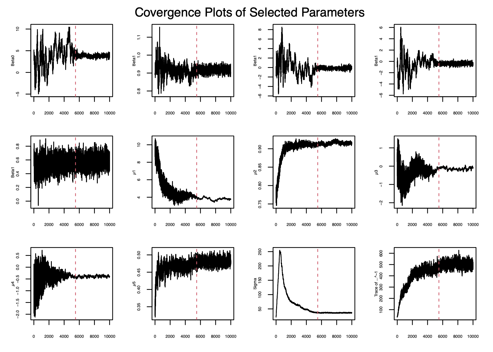
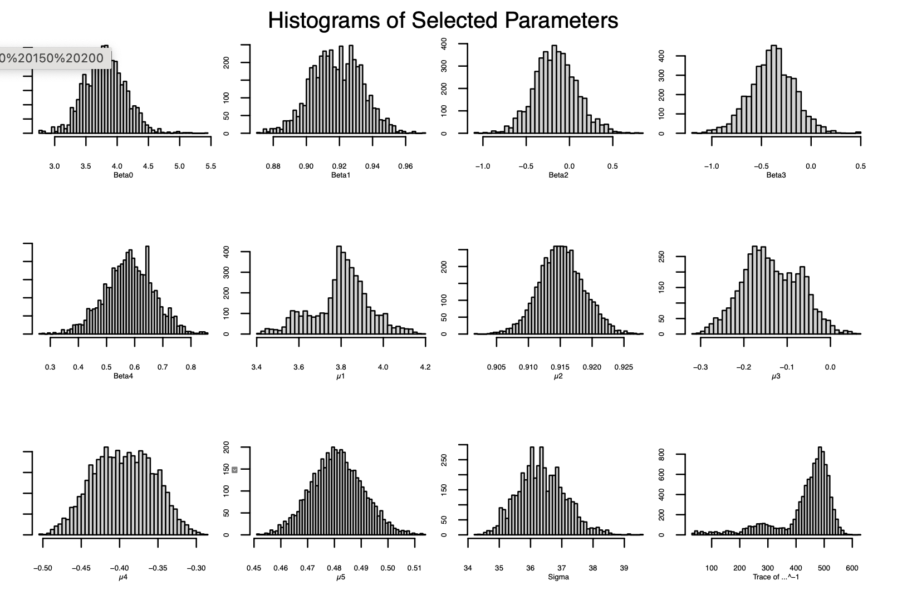
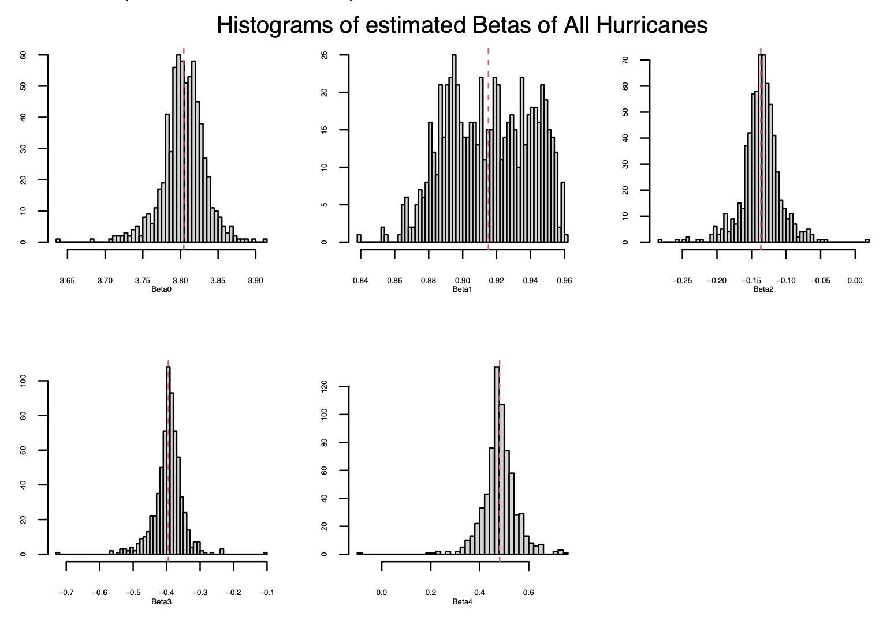

```{r setup, include=FALSE}
library(ggplot2)
library(tidyverse)
library(data.table)
library(maps)
library(gtsummary)

dt = read.csv("hurrican703.csv")
load("df_rm.RData")

load("mcmc_chain_1.RData")
load("mcmc_chain_2.RData")
load("mcmc_chain_3.RData")
load("mcmc_chain_4.RData")
load("mcmc_chain_5.RData")
load("mcmc_chain_6.RData")

# saving all data
theta_chain = rbind(theta_chain_1, theta_chain_2, theta_chain_3, 
                    theta_chain_4, theta_chain_5, theta_chain_6)

```

# Motivation

Climate researchers are interested in modeling the hurricane trajectories to forcase the windspeed.

## Data 

- **ID**: ID of hurricanes
- **Year**: In which the hurricane occurred
- **Month**: In which the hurricane occurred
- **Nature**: Nature of the hurricane
  - ET: Extra Tropical
  - DS: Disturbance
  - NR: Not Rated
  - SS: Sub Tropical
  - TS: Tropical Storm
- **Time**: dates and time of the record
- **Latitude** and **Longitude**: The location of a hurricane check point
- **Wind.kt**: Maximum wind speed (in Knot) at each check point


# Outline

1. Exploration into the Data 
2. Bayesian modeling of hurricane wind speed
  - Model Equation
  - Posterior Derivation 
  - MCMC Algorithm 
3. How Month, Year, and the Nature of the hurricane affect wind speed
  - Explore seasonal differences
  - Explore if wind speeds is increasing over years
4. Exploring wind speeds impact on death and damages
  - As well as the characteristic of a hurricane associated with damages and deaths


# Data 
```{r echo=FALSE, message=FALSE, warning=FALSE}
dt <- as.data.table(dt)
df_temp = dt %>%
  mutate(
    Nature = factor(Nature),
    Season = factor(Season), # season is year not season.... 
    #Month = factor(Month),
    Month = factor(Month, levels = c(month.name)),
  )

map <- ggplot(df_temp, aes(x = Longitude, y = Latitude, group = ID)) + 
  geom_polygon(
    data = map_data("world"), 
    aes(x = long, y = lat, group = group), 
    fill = "gray25", colour = "gray10", size = 0.2
  ) + 
  geom_path(data = df_temp, aes(group = ID, colour = Wind.kt), size = 0.5) + 
  xlim(-138, -20) + ylim(3, 55) + 
  labs(x = "", y = "", colour = "Wind \n(knots)") + 
  theme(panel.background = element_rect(fill = "gray10", colour = "gray30"),
        axis.text.x = element_blank(), axis.text.y = element_blank(), 
        axis.ticks = element_blank(), panel.grid.major = element_blank(),
        panel.grid.minor = element_blank())

seasonrange <- paste(range(dt[, Season]), collapse=" - ")

mapMonth <- map + facet_wrap(~ Month) +
  ggtitle(paste("Atlantic named Windstorm Trajectories by Month (", 
                 seasonrange, ")\n")) 
mapMonth
```


# Data Cleaning 

- We are only concerned about observations that occurred on 6 hour intervals. hour 0, 6, 12, and 18. 
- In addition we will exclude all hurricane IDs that have less then 7 observations. 
- We used a lag ($t$ to $t-6$) for the latitude, longitude and wind speed. 

Through this process we remove `r (dim(dt)[1]-dim(df_rm)[1])` observations so we are left with `r dim(df_rm)[1]` observations and `r length(unique(df_rm$ID))` unique hurricanes. 

# Bayesian Model for Hurricane Trajectories

To model the wind speed of the $i^{th}$ hurricane at time $t$ we will use
$$
\scriptsize{
Y_i(t+6) = \beta_{0,i}+\beta_{1,i}Y_i(t)+\beta_{2,i}\Delta_{i,1}(t)+\beta_{3,i}\Delta_{i,2}(t)+\beta_{4,i}\Delta_{i,3}(t) + \epsilon_i(t)
}
$$
Where 

- $\Delta_{i,1}(t)$, $\Delta_{i,2}(t)$ and $\Delta_{i,3}(t)$ are changes in latitude longitude and wind speed respectively between $t-6$ and $t$
- $\epsilon_i(t) \sim N(0, \sigma^2)$ independent across $t$
- Let $\beta_i = ( \beta_{0,i},  \beta_{1,i},  \beta_{2,i}, \beta_{3,i}, \beta_{4,i}) \sim \mathcal{N}(\mu, \Sigma)$ be multivariate normal distribution where $\mu \in \mathbb{R}^d$ and $\Sigma \in \mathbb{R}^{d \times d}$.

**Prior Distributions Assumptions**: 

- For $\sigma^2$ we assume $\pi(\sigma^2) \propto \frac{1}{\sigma^2}$
- For $\mu$ we assume $\pi(\mu) \propto 1$
- For $\Sigma$ we assume $\pi\left(\Sigma^{-1}\right) \propto \left|\Sigma \right|^{-(d+1)}\exp\left\{ -\frac{1}{2} \Sigma^{-1}\right\}$


**Goal**: Estimate $\Theta = (\boldsymbol B, \boldsymbol \mu, \Sigma^{-1}, \sigma^{2})$

# Likelihood \& Prior Function
**Likelihood**
\[ \scriptsize{
L(\boldsymbol Y \mid \boldsymbol \theta) \propto \prod_{i=1}^{m}\left(\sigma^{2}\right)^{-\frac{n_{i}}{2}} \exp \left\{-\frac{1}{2 \sigma^{2}}\left(\boldsymbol Y_{i}-\boldsymbol X_{i} \boldsymbol \beta_{i}\right)^{T}\left(\boldsymbol Y_{i}-\boldsymbol X_{i} \boldsymbol \beta_{i}\right)\right\} }
\]
where $m$ is the number of hurricane and $n_i$ is the number of observations for $i^{th}$ hurricane


**Prior** Let $\boldsymbol\theta=(\boldsymbol B, \boldsymbol \mu, \Sigma^{-1}, \sigma^{2})$
$$
\scriptsize{
\begin{aligned}
\pi\left(\boldsymbol\theta \right) & \propto\left(\sigma^{2}\right)^{-1} \left|\Sigma^{-1}\right|^{d+1} \exp \left\{-\frac{1}{2} \operatorname{tr}\left(\Sigma^{-1}\right)\right\} 
\prod_{i=1}^{m}\left|\Sigma^{-1}\right|^{\frac{1}{2}}\exp \left\{-\frac{1}{2}\left(\boldsymbol \beta_{i}-\boldsymbol \mu \right)^{T} \Sigma^{-1}(\boldsymbol \beta_{i}-\boldsymbol \mu)\right\}
\end{aligned}
}
$$
where $d$ is the dimension of $\boldsymbol \mu$


# Posterior Calculation

**Posterior**
$$
\scriptsize{
\begin{aligned}
\pi(\boldsymbol \theta \mid \boldsymbol Y) & \propto \left(\sigma^{2}\right)^{-\left(1+\frac{\sum_{i=1}^{m} n_{i}}{2} \right)}\left|\Sigma^{-1}\right|^{d+1+\frac{m}{2}} 
\exp \left\{-\frac{1}{2} \operatorname{tr}\left(\Sigma^{-1}\right) \right\}\\
&\times \exp \left\{-\frac{1}{2} \sum_{i=1}^{m}\left(\boldsymbol \beta_{i}-\boldsymbol \mu\right)^{T} \Sigma^{-1}\left(\boldsymbol \beta_{i}-\boldsymbol \mu\right)\right\} 
 \exp \left\{-\frac{1}{2 \sigma^{2}} \sum_{i=1}^{m}\left(\boldsymbol Y_{i}-\boldsymbol X_{i} \boldsymbol \beta_{i}\right)^{T}\left(\boldsymbol Y_{i}-\boldsymbol X_{i} \boldsymbol \beta_{i}\right)\right\}
\end{aligned}
}
$$
**Conditional Posterior**
$$
\scriptsize{
\begin{aligned}
&\boldsymbol \beta_i:
\pi(\boldsymbol \beta_i \mid \boldsymbol \theta_{(-\boldsymbol \beta_i)} \boldsymbol Y) \propto \exp \left\{-\frac{1}{2}\left(\boldsymbol \beta_{i}-\boldsymbol \mu\right)^{T} \Sigma^{-1}\left(\boldsymbol \beta_{i}-\boldsymbol \mu\right)-\frac{1}{2 \sigma^{2}}\left(\boldsymbol Y_{i}-\boldsymbol X_{i} \boldsymbol \beta_{i}\right)^{T}\left(\boldsymbol Y_{i}-\boldsymbol X_{i} \boldsymbol \beta_{i}\right)\right\}\\
&\boldsymbol \mu:
\pi\left(\boldsymbol \mu \mid \boldsymbol \theta_{(-\boldsymbol \mu)}, \boldsymbol Y\right)  \sim N(\bar{\boldsymbol \beta},\Sigma/m) \\
&\sigma^2: \pi\left(\sigma^{2} \mid \boldsymbol \theta_{(-\sigma^{2})}, \boldsymbol Y\right) \propto \left(\sigma^{2}\right)^{-\left(1+\frac{\sum_{i=1}^{m} n_{i}}{2} \right)}
\times \exp \left\{-\frac{1}{2 \sigma^{2}} \sum_{i=1}^{m}\left(\boldsymbol Y_{i}-\boldsymbol X_{i} \boldsymbol \beta_{i}\right)^{T}\left(\boldsymbol Y_{i}-\boldsymbol X_{i} \boldsymbol \beta_{i}\right)\right\} \\
&\Sigma^{-1}:
\pi\left(\Sigma^{-1} \mid \boldsymbol \theta_{\left(-\Sigma^{-1}\right)},\boldsymbol Y\right) \sim \mathrm{Wishart}\left(3d+3+m,\left(\boldsymbol I+\sum_{i=1}^{m}\left(\boldsymbol \beta_{i}-\boldsymbol \mu\right)\left(\boldsymbol \beta_{i}-\boldsymbol \mu\right)^{T}\right)^{-1} \right)
\end{aligned}
}
$$


# MCMC Algorithm 

We apply hybrid algorithm consisting with Metropolis-Hastings steps and Gibbs steps.

Update component wise: 

- Sampling proposed $\beta_{ij}^{\prime}$, $j = 0,1...4$ for $i^{th}$ hurricane from proposal distribution $U\left(\beta_{ij}^{(t)}-a_{ij},\beta_{ij}^{(t)}+a_{ij}\right)$, where $a_{ij}$ is the search window for $\beta_{ij}$. Since the proposals are symmetry, the accepting or rejecting the proposed $\beta_{ij}^{\prime}$ depends on the ratio of posterior distribution.
- Then, Gibb step for $\boldsymbol \mu$: Sample $\boldsymbol \mu^{(t+1)}$ from $N \left(\bar{\boldsymbol \beta}^{(t+1)} ,\Sigma^{(t)}/m\right)$, where $\bar{\boldsymbol \beta}^{(t+1)}$ is the average over $\boldsymbol \beta_i^{(t+1)}$.
- Next, MH step to generate $\sigma^{2^{\prime}}$ from $U\left(\sigma^{2^{(t)}}-a_{\sigma^2},\sigma^{2^{(t)}}+a_{\sigma^2}\right)$.
- Finally, we sample $\Sigma^{-1^{(t+1)}}$ from  $\scriptsize{\mathrm{Wishart}\left(3d+3+m,\left(\boldsymbol I+\sum_{i=1}^{m}\left(\boldsymbol \beta_{i}^{(t+1)}-\boldsymbol \mu^{(t+1)}\right)\left(\boldsymbol \beta_{i}^{(t+1)}-\boldsymbol \mu^{(t+1)}\right)^{T}\right)^{-1} \right)}$ 


# Initial Starting Values

\begin{columns}
  \begin{column}{0.47\textwidth}
    \textbf{Initial Values:}
    \begin{itemize}
    \item $\boldsymbol \beta_{i}$: Fit multivariate linear regression (MLR) for $i^{th}$ hurricane and use the coefficients as $\boldsymbol \beta_{i0}$
    \item $\boldsymbol \mu$: Average over all $\boldsymbol \beta_{i0}$ as $\boldsymbol \mu_0$ 
    \item $\sigma^2$: $\hat{\sigma}^2_i$ is the mean square residuals of the MLR model on $i^{th}$ hurricane. Take the mean over all $\hat{\sigma}^2_i$ as $\sigma^2_0$
    \item $\Sigma^{-1}$: Generate the covaraiance matrix of $\boldsymbol \beta_{i0}$ and take the inverse of the matrix as $\Sigma^{-1}_0$
    \end{itemize}
  \end{column}
  \begin{column}{0.5\textwidth}
  \centering 
   \begin{table}
    \centering
    \caption{Range of Search Window and Acceptance Rate for paraemters used MH step}
    \resizebox{\linewidth}{!}{
    \begin{tabular}{|c|c|c|} \hline 
     & Search Window& Acceptance Rate (\%) \\ \hline 
        $\beta_0$ & 1.1 & 45.87 - 51.36\\ \hline 
        $\beta_1$ & (0.04, 0.1) & 31.67 - 63.68\\ \hline 
        $\beta_2$ & (0.8, 1.0) & 38.60 - 45.60\\ \hline 
        $\beta_3$ & (0.5, 0.6) & 33.20 - 61.32\\ \hline 
        $\beta_4$ & (0.4, 0.5) & 34.95 - 60.45\\ \hline 
        $\sigma^2$ & 2.0 & 44.83\\ \hline 
    \end{tabular}
    }
\end{table}
  \end{column}
\end{columns}


# MCMC Model Convergence 



```{r eval=FALSE, message=FALSE, warning=FALSE, include=FALSE}

# Initialize paramaters
## create variables of interest
dt = df_rm %>% 
  janitor::clean_names() %>% 
  group_by(id) %>% 
  mutate(wind_lag = lag(wind_kt,1), ##previous wind speed
         lat_shift = lag(latitude, 1) - lag(latitude, 2), ## change of lat
         long_shift = lag(longitude, 1) - lag(longitude, 2), ## change of long
         wind_shift = lag(wind_kt, 1) - lag(wind_kt, 2)) %>%  ##change of wind speed
  drop_na()

## group by hurricane and create design matrix for each hurricane
d = 5  ## dimension of beta_i
m = 681  ## number of hurricanes
L = 1.5

par(mfrow=c(3,4))
par(mar = c(2, 2, 2, 2))
plot(theta_chain[,2], type = "l", cex.axis = 0.5, xlab = "", ylab = "")
abline(v = 5500, lty = 2, col = 2)
title(ylab = "Beta0", line = L, cex.lab = 0.5)
plot(theta_chain[,m+2], type = "l", cex.axis = 0.5, xlab = "", ylab = "")
abline(v = 5500, lty = 2, col = 2)
title(ylab = "Beta1", line = L, cex.lab = 0.5)
mtext("                                 Covergence Plots of Selected Parameters", side = 3, line = 0.6)
plot(theta_chain[,m*2+2], type = "l", cex.axis = 0.5, xlab = "", ylab = "")
abline(v = 5500, lty = 2, col = 2)
title(ylab = "Beta1", line = L, cex.lab = 0.5)
plot(theta_chain[,m*3+2], type = "l", cex.axis = 0.5, xlab = "", ylab = "")
abline(v = 5500, lty = 2, col = 2)
title(ylab = "Beta1", line = L, cex.lab = 0.5)
plot(theta_chain[,m*4+2], type = "l", cex.axis = 0.5, xlab = "", ylab = "")
abline(v = 5500, lty = 2, col = 2)
title(ylab = "Beta1", line = L, cex.lab = 0.5)
plot(theta_chain[,3406], type = "l", cex.axis = 0.5, xlab = "", ylab = "")
abline(v = 5500, lty = 2, col = 2)
title(ylab = "µ1", line = L, cex.lab = 0.5)
plot(theta_chain[,3407], type = "l", cex.axis = 0.5, xlab = "", ylab = "")
abline(v = 5500, lty = 2, col = 2)
title(ylab = "µ2", line = L, cex.lab = 0.5)
plot(theta_chain[,3408], type = "l", cex.axis = 0.5, xlab = "", ylab = "")
abline(v = 5500, lty = 2, col = 2)
title(ylab = "µ3", line = L, cex.lab = 0.5)
plot(theta_chain[,3409], type = "l", cex.axis = 0.5, xlab = "", ylab = "")
abline(v = 5500, lty = 2, col = 2)
title(ylab = "µ4", line = L, cex.lab = 0.5)
plot(theta_chain[,3410], type = "l", cex.axis = 0.5, xlab = "", ylab = "")
abline(v = 5500, lty = 2, col = 2)
title(ylab = "µ5", line = L, cex.lab = 0.5)
plot(theta_chain[,3411], type = "l", cex.axis = 0.5, xlab = "", ylab = "")
abline(v = 5500, lty = 2, col = 2)
title(ylab = "Sigma", line = L, cex.lab = 0.5)


# plot(theta_trace_inverse, type = "l", cex.axis = 0.5, xlab = "", ylab = "")
# abline(v = 5500, lty = 2, col = 2)
# title(ylab = "Trace of ∑^-1", line = L, cex.lab = 0.5)
```


# MCMC Model Convergence 



```{r eval=FALSE, message=FALSE, warning=TRUE, include=FALSE}
L = 1.5
d = 5  ## dimension of beta_i
m = 681  ## number of hurricanes
n_beta = m*d  ## total number of beta
n_theta = n_beta+d+1+15  ## total number of parameters
mu_ind = (n_beta+1):(n_beta+d) ## index of mu
sigma_ind = n_beta+d+1 ## index of sigma
cov_m_ind = (n_beta+d+2):n_theta ## index of elements of inverse covariance matrix

## take average over 5501-10000 as estimates
bs_estimates = unname(apply(theta_chain[5501:10000,], 2, mean))


inv_cov_m = matrix(0,5,5)
inv_cov_m[lower.tri(inv_cov_m, diag = TRUE)] = bs_estimates[cov_m_ind]
inv_cov_m[upper.tri(inv_cov_m)] = t(inv_cov_m)[upper.tri(inv_cov_m)]


cov_m = solve(inv_cov_m)

## estimates
sigma = bs_estimates[3411]
mu = bs_estimates[3406:3410]
beta = matrix(bs_estimates[1:n_beta], ncol = d)

par(mfrow=c(2,3))
par(mar = c(3, 2, 3, 2))
hist(beta[,1], nclass = 50, main = NULL, xlab = "", ylab = "", cex.axis = 0.5)
abline(v = mu[1], lty = 2, col = 2)
title(xlab = "Beta0", cex.lab = 0.5, line = L)
hist(beta[,2], nclass = 50, main = NULL, xlab = "", ylab = "", cex.axis = 0.5)
abline(v = mu[2], lty = 2, col = 2)
title(xlab = "Beta1", cex.lab = 0.5, line = L)
mtext("Histograms of estimated Betas of All Hurricanes", side = 3, line = 0.6)
hist(beta[,3], nclass = 50, main = NULL, xlab = "", ylab = "", cex.axis = 0.5)
abline(v = mu[3], lty = 2, col = 2)
title(xlab = "Beta2", cex.lab = 0.5, line = L)
hist(beta[,4], nclass = 50, main = NULL, xlab = "", ylab = "", cex.axis = 0.5)
abline(v = mu[4], lty = 2, col = 2)
title(xlab = "Beta3", cex.lab = 0.5, line = L)
hist(beta[,5], nclass = 50, main = NULL, xlab = "", ylab = "", cex.axis = 0.5)
abline(v = mu[5], lty = 2, col = 2)
title(xlab = "Beta4", cex.lab = 0.5, line = L)
```


# $\Beta$ Estimates  




# The $\mu$ and $\sigma^2$ Estiamtes 


# Model Preformance 


# Understanding Seasonal differnces in Hurricane Wind Speed


# Exploring if wind speeds has increased over the years


# Deaths and Damages Data Exploration 


# Hurricane Deaths


# Hurricane Damages


# Conclusions 

- Largers Samples give better estimates 
- High dim sample space, burn in takes longer than expected 
  - very sensitive to starting values


```{r echo=FALSE, message=FALSE, warning=FALSE, fig.width = 8, fig.asp=0.8, fig.align='center'}
# figure
```
