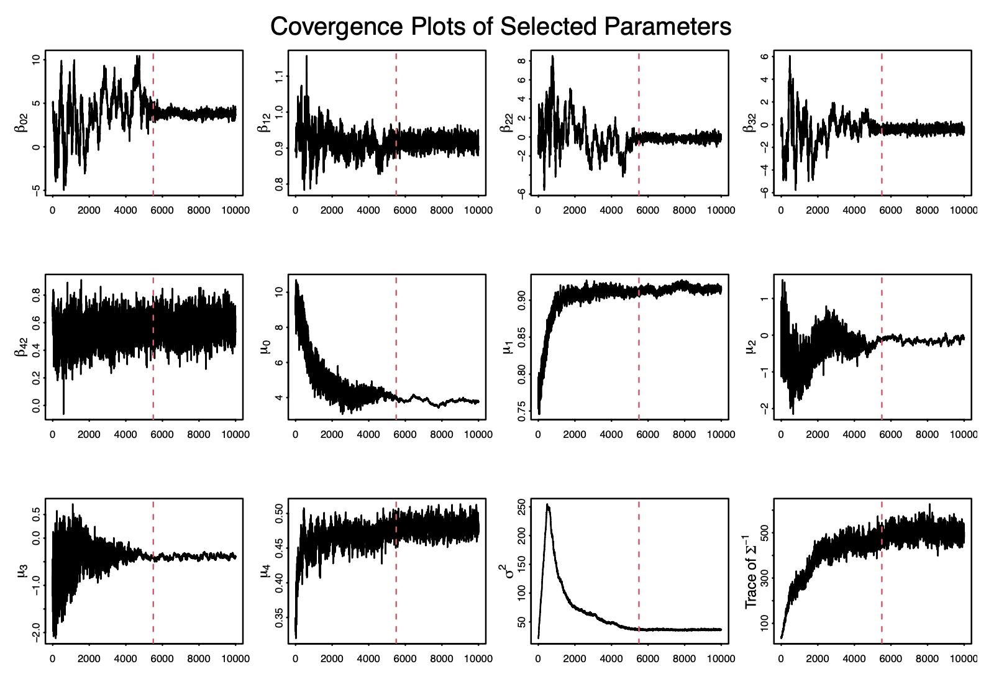
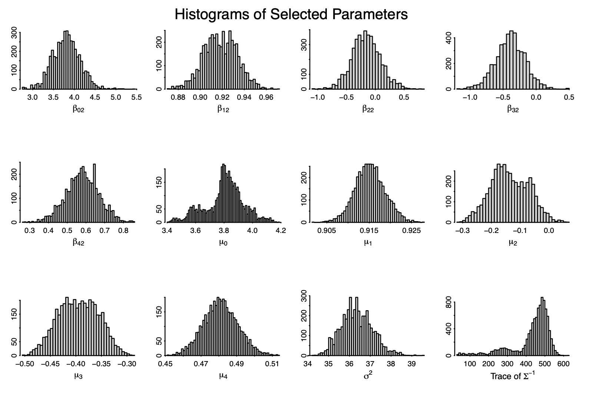

```{r setup, include=FALSE}
knitr::opts_chunk$set(echo = TRUE)

library(ggplot2)
library(tidyverse)
library(data.table)
library(maps)
library(gtsummary)

dt = read.csv("hurrican703.csv")

load("df_rm.RData")
theme_gtsummary_compact()
```


\vspace{75mm}

\begin{center}
{\bf Abstract}
\end{center}

|        abstract 

\newpage
# 1. Introduction

## 1.1. Background


## 1.2. Objectives


# 2. Methods

## 2.1. Data Cleaning and Exploratory Analysis

```{r message=FALSE, warning=TRUE, include=FALSE}
temp = table(dt$ID) %>% as.data.frame() 
```

There are `r length(unique(dt$ID))` unique hurricanes in this dataset all the occurred in the north american region between the years `r range(dt$Season)[1]` to `r range(dt$Season)[2]`. Data on the storm's location (longitude & latitude) and maximum wind speed were recorded every 6 hours. The number of observations we have for each storm range from `r range(temp$Freq)[1]` to `r range(temp$Freq)[2]` with a mean value of `r round(mean(temp$Freq))` observations per hurricane. Data is also collected on the storms month, and the nature of the hurricane; (Extra Tropical (ET), Disturbance (DS), Not Rated (NR), Sub Tropical (SS), and Tropical Storm (TS)). 

To conduct our analysis we require at least 7 observations for each unique hurricane. In addition, we are only concerned about observations that occurred on 6 hour intervals. The dataset includes a couple observations between the 6 hour time periods. For our analysis we are only going to include observations that are recorded on hour 0, 6, 12, and 18. In addition we will exclude all hurricane IDs that have less then 7 observations. Through this process we remove `r (dim(dt)[1]-dim(df_rm)[1])` observations so we are left with `r dim(df_rm)[1]` observations and `r length(unique(df_rm$ID))` unique hurricanes. In addition we also created lag ($t$ to $t-6$) variables for latitude, longitude and wind speed. 

\begin{center}
\textit{Table 1: Data Characteristics shown by the Nature of the Hurricane variable}
\end{center}

```{r echo=FALSE, message=FALSE, warning=FALSE}
df_rm %>%
  #arrange(match(Month, month.name)) %>% 
  select(Nature, Wind.kt, Latitude, Longitude,  Month ) %>% 
  tbl_summary(by =Nature ) %>%
  add_overall() %>% 
  modify_spanning_header(c("stat_1", "stat_2","stat_3","stat_4","stat_5") ~ "**Nature of the Hurricane**") 

```


## 2.2 Bayesian Model for Hurricane Trajectories

Climate researchers are interested in modeling the hurricane trajectories to forecast the winds peed. To model the wind speed of the $i^{th}$ hurricane at time $t$ we will use
$$
Y_i(t+6) = \beta_{0,i}+\beta_{1,i}Y_i(t)+\beta_{2,i}\Delta_{i,1}(t)+\beta_{3,i}\Delta_{i,2}(t)+\beta_{4,i}\Delta_{i,3}(t) + \epsilon_i(t)
$$
Where  $\Delta_{i,1}(t)$, $\Delta_{i,2}(t)$ and $\Delta_{i,3}(t)$ are changes in latitude longitude and wind speed respectively between $t-6$ and $t$. The $\epsilon_i(t) \sim N(0, \sigma^2)$ are independent across $t. Let $\beta_i = ( \beta_{0,i},  \beta_{1,i},  \beta_{2,i}, \beta_{3,i}, \beta_{4,i}) \sim \mathcal{N}(\mu, \Sigma)$ be multivariate normal distribution where $\mu \in \mathbb{R}^d$ and $\Sigma \in \mathbb{R}^{d \times d}$. For this model we will be assuming non-informative or weak prior distributions for our unknown parameters $\sigma^2$,  $\mu$ and $\Sigma$ . 
\[
\pi(\sigma^2) \propto \frac{1}{\sigma^2}, \ \ \ \ \ \ \pi(\mu) \propto 1, \ \ \ \ \ \  \pi\left(\Sigma^{-1}\right) \propto \left|\Sigma \right|^{-(d+1)}\exp\left\{ -\frac{1}{2} \Sigma^{-1}\right\} 
\]
Our goal is to estimate $\Theta = (\boldsymbol B, \boldsymbol \mu, \Sigma^{-1}, \sigma^{2})$. To do this we need to establish our likelihood and prior functions. Since this is a Bayesian model we have that the likelihood will be expressed as 
\[ 
L(\boldsymbol Y \mid \boldsymbol \theta) \propto \prod_{i=1}^{m}\left(\sigma^{2}\right)^{-\frac{n_{i}}{2}} \exp \left\{-\frac{1}{2 \sigma^{2}}\left(\boldsymbol Y_{i}-\boldsymbol X_{i} \boldsymbol \beta_{i}\right)^{T}\left(\boldsymbol Y_{i}-\boldsymbol X_{i} \boldsymbol \beta_{i}\right)\right\} 
\]
where $m$ is the number of hurricane and $n_i$ is the number of observations for $i^{th}$ hurricane. The joint prior distribution is expressed as 
\[
\pi\left(\boldsymbol\theta=(\boldsymbol B, \boldsymbol \mu, \Sigma^{-1}, \sigma^{2})\right) \propto\left(\sigma^{2}\right)^{-1} \left|\Sigma^{-1}\right|^{d+1} \exp \left\{-\frac{1}{2} \operatorname{tr}\left(\Sigma^{-1}\right)\right\}\prod_{i=1}^{m}\left|\Sigma^{-1}\right|^{\frac{1}{2}}\exp \left\{-\frac{1}{2}\left(\boldsymbol \beta_{i}-\boldsymbol \mu \right)^{T} \Sigma^{-1}(\boldsymbol \beta_{i}-\boldsymbol \mu)\right\}
\]
where $d$ is the dimension of $\boldsymbol \mu$. Using the likelihood and priors derived above we can calculate the posterior distribution. 
$$
\begin{aligned}
\pi(\boldsymbol \theta \mid \boldsymbol Y) & \propto\left(\sigma^{2}\right)^{-1}\left|\Sigma^{-1}\right|^{d+1} 
\exp \left\{-\frac{1}{2}+ \operatorname{tr}\left(\Sigma^{-1}\right)\right\}\\ 
&\times \prod_{i=1}^{m}\left(\sigma^{2}\right)^{-\frac{n_{i}}{2}}\left|\Sigma^{-1}\right|^{\frac{1}{2}} 
\exp \left\{-\frac{1}{2 \sigma^{2}}\left(\boldsymbol Y_{i}-\boldsymbol X_{i} \boldsymbol \beta_{i}\right)^{T}\left(\boldsymbol Y_{i}-\boldsymbol X_{i} \boldsymbol \beta_{i}\right)\right\} 
\exp \left\{-\frac{1}{2}\left(\boldsymbol \beta_{i}-\boldsymbol \mu\right)^{T} \Sigma^{-1}\left(\boldsymbol \beta_{i}-\boldsymbol \mu\right)\right\}\\
&= \left(\sigma^{2}\right)^{-\left(1+\frac{\sum_{i=1}^{m} n_{i}}{2} \right)}\left|\Sigma^{-1}\right|^{d+1+\frac{m}{2}} 
\exp \left\{-\frac{1}{2} \operatorname{tr}\left(\Sigma^{-1}\right) \right\}
\exp \left\{-\frac{1}{2} \sum_{i=1}^{m}\left(\boldsymbol \beta_{i}-\boldsymbol \mu\right)^{T} \Sigma^{-1}\left(\boldsymbol \beta_{i}-\boldsymbol \mu\right)\right\} \\
&\times \exp \left\{-\frac{1}{2 \sigma^{2}} \sum_{i=1}^{m}\left(\boldsymbol Y_{i}-\boldsymbol X_{i} \boldsymbol \beta_{i}\right)^{T}\left(\boldsymbol Y_{i}-\boldsymbol X_{i} \boldsymbol \beta_{i}\right)\right\}
\end{aligned}
$$

Due to the number of unknown parameters and the complexity we will need to use method to approximate this distribution. Before describing that process we first need to calculate the conditional posterior distribution for each unknown parameter. 
$$
\begin{aligned}
&\boldsymbol \beta_i:
\pi(\boldsymbol \beta_i \mid \boldsymbol \theta_{(-\boldsymbol \beta_i)} \boldsymbol Y) \propto \exp \left\{-\frac{1}{2}\left(\boldsymbol \beta_{i}-\boldsymbol \mu\right)^{T} \Sigma^{-1}\left(\boldsymbol \beta_{i}-\boldsymbol \mu\right)-\frac{1}{2 \sigma^{2}}\left(\boldsymbol Y_{i}-\boldsymbol X_{i} \boldsymbol \beta_{i}\right)^{T}\left(\boldsymbol Y_{i}-\boldsymbol X_{i} \boldsymbol \beta_{i}\right)\right\}\\
&\boldsymbol \mu:
\pi\left(\boldsymbol \mu \mid \boldsymbol \theta_{(-\boldsymbol \mu)}, \boldsymbol Y\right)  \sim N(\bar{\boldsymbol \beta},\Sigma/m) \\
&\sigma^2: \pi\left(\sigma^{2} \mid \boldsymbol \theta_{(-\sigma^{2})}, \boldsymbol Y\right) \propto \left(\sigma^{2}\right)^{-\left(1+\frac{\sum_{i=1}^{m} n_{i}}{2} \right)}
\times \exp \left\{-\frac{1}{2 \sigma^{2}} \sum_{i=1}^{m}\left(\boldsymbol Y_{i}-\boldsymbol X_{i} \boldsymbol \beta_{i}\right)^{T}\left(\boldsymbol Y_{i}-\boldsymbol X_{i} \boldsymbol \beta_{i}\right)\right\} \\
&\Sigma^{-1}:
\pi\left(\Sigma^{-1} \mid \boldsymbol \theta_{\left(-\Sigma^{-1}\right)},\boldsymbol Y\right) \sim \mathrm{Wishart}\left(3d+3+m,\left(\boldsymbol I+\sum_{i=1}^{m}\left(\boldsymbol \beta_{i}-\boldsymbol \mu\right)\left(\boldsymbol \beta_{i}-\boldsymbol \mu\right)^{T}\right)^{-1} \right)
\end{aligned}
$$

To see a more detailed description of each conditional posterior please see Appendix A. 


## 2.3 Markov Chain Monte Carlo (MCMC) Algorithm
Due to the complexity of the above posterior distribution we will use a Markov chain Monte Carlo (MCMC) process. Since we could generate full conditional posterior distribution for some parameters but not all we will instead apply hybrid algorithm consisting with Metropolis-Hastings (MH) steps and Gibbs steps. We will preform a MH step for $\beta_{ij}$, $\sigma^2$ and sample from the $\Sigma^{-1^{(t+1)}}$ distribution. We will also describe a gibbs step for $\mu$ using the  $\beta_{ij}$ gathered. 


First is the MH steps for $\beta_{ij}$. Sampling proposed $\beta_{ij}^{\prime}$, $j = 0,1...4$ for $i^{th}$ hurricane from proposal distribution $U\left(\beta_{ij}^{(t)}-a_{ij},\beta_{ij}^{(t)}+a_{ij}\right)$, where $a_{ij}$ is the search window for $\beta_{ij}$. Since the proposals are symmetry, the accepting or rejecting the proposed $\beta_{ij}^{\prime}$ depends on the ratio of posterior distribution. Some of the parameters in $\boldsymbol \theta$ could be cancelled out, so the ratio simplified to be:

$$
\frac{\pi\left(\boldsymbol \beta_{i}^{\prime},\boldsymbol \theta_{(-\boldsymbol \beta_i)}^{(t)} \mid \boldsymbol Y\right)}{\pi\left(\boldsymbol \beta_{i}^{(t)}, \boldsymbol \theta_{(-\boldsymbol \beta_i)}^{(t)} \mid \boldsymbol Y\right)}
=\frac{\exp \left\{-\frac{1}{2 \sigma^{2(t)}}\left(\boldsymbol Y_{i}-\boldsymbol X_{i} \boldsymbol \beta_{i}^{\prime}\right)^{T}\left(\boldsymbol Y_{i}-\boldsymbol X_{i} \boldsymbol \beta_{i}^{\prime}\right)-\frac{1}{2} \left(\boldsymbol \beta_{i}^{\prime}-\boldsymbol \mu^{(t)}\right)^{T}\Sigma^{-1^{(t)}}\left(\boldsymbol \beta_{i}^{\prime}-\boldsymbol \mu^{(t)}\right)\right\}}{\exp \left\{-\frac{1}{2 \sigma^{2(t)}}\left(\boldsymbol Y_{i}-\boldsymbol X_{i} \boldsymbol \beta_{i}^{(t)}\right)^{T}\left(\boldsymbol Y_{i}-\boldsymbol X_{i} \boldsymbol \beta_{i}^{(t)}\right)-\frac{1}{2}\left(\boldsymbol \beta_{i}^{(t)}-\boldsymbol \mu^{(t)}\right){ }^{T} \Sigma^{-1(t)}\left(\boldsymbol \beta_{i}^{(t)}-\boldsymbol \mu^{(t)}\right)\right\}}
$$
where $\boldsymbol \beta_i^{\prime}$ consisting with $\beta_{ij}^{\prime}$, $\beta_{ik}^{(t)}$ for $k>j$ and $\beta_{ik}^{(t+1)}$ for $k<j$. The log of the ratio is
$$
\begin{aligned}
\log \frac{\pi\left(\boldsymbol \beta_{i}^{\prime},\boldsymbol \theta_{(-\boldsymbol \beta_i)}^{(t)} \mid \boldsymbol Y\right)}{\pi\left(\boldsymbol \beta_{i}^{(t)}, \boldsymbol \theta_{(-\boldsymbol \beta_i)}^{(t)} \mid \boldsymbol Y\right)} &=-\frac{1}{2}\left(\frac{\left(\boldsymbol Y_{i}-\boldsymbol X_{i} \boldsymbol \beta_{i}^{\prime}\right)^{T}\left(\boldsymbol Y_{i}-\boldsymbol X_{i} \boldsymbol \beta_{i}^{\prime}\right)}{\sigma^{2(t)}}+\left(\boldsymbol \beta_{i}^{\prime}-\boldsymbol \mu^{(t)}\right)^{T} \Sigma^{-1^{(t)}}\left(\boldsymbol \beta_{i}^{\prime}-\boldsymbol \mu^{(t)}\right)\right)\\
&+\frac{1}{2}\left(\frac{\left(\boldsymbol Y_{i}-\boldsymbol X_{i} \boldsymbol \beta_{i}^{(t)}\right)^{T}\left(\boldsymbol Y_{i}-\boldsymbol X_{i} \boldsymbol \beta_{i}^{(t)}\right)}{\sigma^{2(t)}}+\left(\boldsymbol \beta_{i}^{(t)}-\boldsymbol \mu^{(t)}\right)^{T} \Sigma^{{-1}^{(t)}}\left(\boldsymbol \beta_{i}^{(t)}-\boldsymbol \mu^{(t)}\right)\right)
\end{aligned}
$$

Then we randomly sample $u$ from $U(0,1)$ and compare $\log(u)$ with the log ratio. If the $\log(u)$ is smaller, we accept $\beta_{ij}^{\prime} = \beta_{ij}^{(t+1)}$, otherwise we reject $\beta_{ij}^{\prime}$ and $\beta_{ij}^{(t)} = \beta_{ij}^{(t+1)}$.


Then, Gibb step for $\boldsymbol \mu$: Sample $\boldsymbol \mu^{(t+1)}$ from $N \left(\bar{\boldsymbol \beta}^{(t+1)} ,\Sigma^{(t)}/m\right)$, where $\bar{\boldsymbol \beta}^{(t+1)}$ is the average over $\boldsymbol \beta_i^{(t+1)}$.


Next, is the MH step to generate $\sigma^{2^{\prime}}$ from $U\left(\sigma^{2^{(t)}}-a_{\sigma^2},\sigma^{2^{(t)}}+a_{\sigma^2}\right)$. Firstly, check whether $\sigma^{2^{\prime}}$ is positive, if not, we reject $\sigma^{2^{\prime}}$. Then, we randomly sample $u$ from $U(0,1)$ and compare $\log(u)$ with
the log posterior ratio. The log posterior ratio
$$
\begin{aligned}
\log \frac{\pi\left(\sigma^{2^{\prime}},\boldsymbol \theta^{(t)}_{(-\sigma^{2})} \mid \boldsymbol Y\right)}{\pi\left( \sigma^{2^{(t)}},\boldsymbol \theta^{(t)}_{(-\sigma^{2})} \mid \boldsymbol Y\right)} 
&= -\left(1+\frac{M}{2}\right)\log(\sigma^{2^{\prime}})-\frac{1}{2\sigma^{2^{\prime}}}\sum_{i=1}^{m}\left(\boldsymbol Y_{i}-\boldsymbol X_{i} \boldsymbol \beta_{i}^{(t+1)}\right)^{T}\left(\boldsymbol Y_{i}-\boldsymbol X_{i} \boldsymbol \beta_{i}^{(t+1)}\right)\\
&+\left(1+\frac{M}{2}\right)\log(\sigma^{2^{(t)}})+\frac{1}{2\sigma^{2^{(t)}}}\sum_{i=1}^{m}\left(\boldsymbol Y_{i}-\boldsymbol X_{i} \boldsymbol \beta_{i}^{(t+1)}\right)^{T}\left(\boldsymbol Y_{i}-\boldsymbol X_{i} \boldsymbol \beta_{i}^{(t+1)}\right)
\end{aligned}
$$

where $M$ is total number of observation for all hurricanes. If the $\log(u)$ is smaller, we accept $\sigma^{2^{\prime}} = \sigma^{2^{(t+1)}}$.


Finally, we sample $\Sigma^{-1^{(t+1)}}$ from  $\mathrm{Wishart}\left(3d+3+m,\left(\boldsymbol I+\sum_{i=1}^{m}\left(\boldsymbol \beta_{i}^{(t+1)}-\boldsymbol \mu^{(t+1)}\right)\left(\boldsymbol \beta_{i}^{(t+1)}-\boldsymbol \mu^{(t+1)}\right)^{T}\right)^{-1} \right).$ 

## 2.4  Initial Starting Values for MCMC 

To initiate the MCMC process we need to specify the starting values. The choice of starting value is important to help with the converence time of our algorithm. For each paramater we will chose the start values to be: 
 \begin{itemize}
    \item $\boldsymbol \beta_{i}$: Fit multivariate linear regression (MLR) for $i^{th}$ hurricane and use the coefficients as $\boldsymbol \beta_{i0}$
    \item $\boldsymbol \mu$: Average over all $\boldsymbol \beta_{i0}$ as $\boldsymbol \mu_0$ 
    \item $\sigma^2$: $\hat{\sigma}^2_i$ is the mean square residuals of the MLR model on $i^{th}$ hurricane. Take the mean over all $\hat{\sigma}^2_i$ as $\sigma^2_0$
    \item $\Sigma^{-1}$: Generate the covaraiance matrix of $\boldsymbol \beta_{i0}$ and take the inverse of the matrix as $\Sigma^{-1}_0$
    \end{itemize}

There is a MH step in the MCMC algorithm so the choice of search window is important. The acceptance rate of the MH step is around 0.317 to 0.637, so the search window of our algorithm is appropriate. We tune the search windows multiple times to achieve this result. Table 1 demonstrates the range of search windows $a$ and associated acceptance rates for $\boldsymbol \beta$ and $\sigma^2$.

\begin{table}
  \centering
  \caption{Range of Search Window and Acceptance Rate for paraemters used MH step}
  \begin{tabular}{|c|c|c|} \hline 
   & Search Window& Acceptance Rate (\%) \\ \hline 
      $\beta_0$ & 1.1 & 45.87 - 51.36\\ \hline 
      $\beta_1$ & (0.04, 0.1) & 31.67 - 63.68\\ \hline 
      $\beta_2$ & (0.8, 1.0) & 38.60 - 45.60\\ \hline 
      $\beta_3$ & (0.5, 0.6) & 33.20 - 61.32\\ \hline 
      $\beta_4$ & (0.4, 0.5) & 34.95 - 60.45\\ \hline 
      $\sigma^2$ & 2.0 & 44.83\\ \hline 
  \end{tabular} 
\end{table}


## 2.5 MCMC Model Performance 

To assess the quality of the proposed model we will assess the overall adjusted  $R^2$ value from the Bayesian model. In addition the model performance will be assessed for each hurricane by the adjusted $R^2$ value as well as a goodness of fit test. The goodness of fit test we will use residuals of Bayesian estimates, $r_{ij}$, of the $j^{th}$ observation in $i^{th}$ hurricane, to calculate the test statistics. $\chi^2_{stat} = \frac{\sum_{j=1}^{n_i}r_{ij}^2}{\sigma^2}$, where $\sigma^2$ is the estimate $\sigma^2$ from MCMC. Based on the normal assumption in intro, $\chi^2_{stat}\sim\chi^2_{n_i}$, where $n_i$ is the number of observation for $i^{th}$ hurricane. Visual inspection can also be used for each individual hurricane plotting their observed wind speed with the model's predicted wind speed. 

## 2.6 Models to Explore Seasonal Differences and Yearly Trends 

In the dataset information about the hurricanes start month, year and the nature of the hurricane is recorded. It is of interested to explore how these three variables affect the wind speed. Specifically we are interested in exploring the seasonal differences, and if there any evidence supporting the statement that "the hurricane wind speed has been increasing over years". To do visual inspection can first be used to help us understand how these three variables impact the beta estimates. Then we can see if there is a linear trend given the three variables using each $\beta$ estimates gained from the Bayesian model described above. 
For each $\beta$ value we fit a different linear model. We can first fit a model using the three variables (month, year, and nature) as predictors and the 5 different $\beta$ values as the outcome. This will result in 5 different linear models, one for each $\beta$ value. 
$$
Y_{ji} = \alpha_{0j} + \alpha_{1j}\times \textrm{Decade}_i 
+ \alpha_{(k+1)j}I(\textrm{Nature} = k)_i
+ \alpha_{(l+5)j}I(\textrm{Month} = l)_i + \epsilon_{ji}
$$
Where $i$ is the hurricane, $j$ is the Beta model (0 through 4), $k \in (ET,\ NR,\ SS,\ TS)$ making DS the reference group. Let $l$ in (April - December) where January is the reference group. We chose to include nature and month as categorical variables and year (transformed into decade) as a continuous variable. 

We are also going to consider 5 different models just using decade as a predictor.  $Y_i = \alpha_{0i}+\alpha_{1i} \times\textrm{Decade}$ where $Y_i$ is each $\beta_i$ and $i \in (0,\dots,4)$.  


## 2.7 Models to Explore Death and Damages 

\textbf{FILL IN}


# 3. Results 

## 3.1 MCMC Model Convergence 
Using the starting values describe above we can now examine the model performance. We are particular interested in the parameter convergence. 







\begin{table}
    \centering
     \caption{Bayesian Estiamtes for $\mu$ and $\sigma^2$ }
    \label{tab:rand_est_mod1}
\end{table}


## 3.2 MCMC Model Performance 


## 3.3 Seasonal Differences and Yearly Trends Results 


## 3.5 Death and Damages Results 


# 4. Discussion 

## 4.1. Summary of Findings


## 4.2. Limitations


## 4.3 Future Work


## 4.4. Group Contributions


\newpage

# References 

\begin{enumerate}[label={[\arabic*]}]
  \item  one 
  \item  two 
\end{enumerate}

\newpage 

# Appendices


# Appendix A 

Calculating the conditional Priors for each paramater. 

$$
\begin{aligned}
&\boldsymbol \beta_i:
\pi(\boldsymbol \beta_i \mid \boldsymbol \theta_{(-\boldsymbol \beta_i)} \boldsymbol Y) \propto \exp \left\{-\frac{1}{2}\left(\boldsymbol \beta_{i}-\boldsymbol \mu\right)^{T} \Sigma^{-1}\left(\boldsymbol \beta_{i}-\boldsymbol \mu\right)-\frac{1}{2 \sigma^{2}}\left(\boldsymbol Y_{i}-\boldsymbol X_{i} \boldsymbol \beta_{i}\right)^{T}\left(\boldsymbol Y_{i}-\boldsymbol X_{i} \boldsymbol \beta_{i}\right)\right\}\\
&\boldsymbol \mu:
\pi\left(\boldsymbol \mu \mid \boldsymbol \theta_{(-\boldsymbol \mu)}, \boldsymbol Y\right)\propto
\exp \left\{-\frac{1}{2} \sum_{i=1}^{m}\left(\boldsymbol \beta_{i}-\boldsymbol \mu\right)^{T} \Sigma^{-1}\left(\boldsymbol \beta_{i}-\boldsymbol \mu\right)\right\}
\end{aligned}
$$
$$
\begin{aligned}
(\boldsymbol \beta_{i}-\boldsymbol \mu)^{T} \Sigma^{-1}(\boldsymbol \beta_{i}-\boldsymbol \mu)
&=\operatorname{tr}\left(\left(\boldsymbol \beta_{i}-\boldsymbol \mu\right)^{T} \Sigma^{-1}\left(\boldsymbol \beta_{i}-\boldsymbol \mu\right)\right)\\
&=\operatorname{tr}\left(\Sigma^{-1}\left(\boldsymbol \beta_{i}-\boldsymbol \mu\right)(\boldsymbol \beta_i-\boldsymbol \mu)^{T}\right)\\
\pi\left(\boldsymbol \mu \mid \boldsymbol \theta_{(-\boldsymbol \mu)}, Y\right)&\propto \exp\left\{-\frac{1}{2}\operatorname{tr}\left(\Sigma^{-1}\sum_{i=1}^{m}\left(\boldsymbol \beta_{i}-\boldsymbol \mu\right)(\boldsymbol \beta_i-\boldsymbol \mu)^{T}\right)\right\}\\
&= \exp\left\{-\frac{1}{2}\operatorname{tr}\left(\Sigma^{-1}m\left(\boldsymbol \mu - \bar{\boldsymbol \beta}\right)(\boldsymbol \mu - \bar{\boldsymbol \beta})^{T}\right)\right\}\\
&= \exp \left\{-\frac{1}{2}(\boldsymbol \mu-\bar{\boldsymbol \beta})^{T}\Sigma^{-1} m(\boldsymbol \mu-\bar{\boldsymbol \beta})\right\}\\
&\Rightarrow \boldsymbol \mu \mid \boldsymbol \theta_{(-\boldsymbol \mu)}, \boldsymbol Y \sim N(\bar{\boldsymbol \beta},\Sigma/m)
\end{aligned} 
$$
$$
\sigma^2: \pi\left(\sigma^{2} \mid \boldsymbol \theta_{(-\sigma^{2})}, \boldsymbol Y\right) \propto \left(\sigma^{2}\right)^{-\left(1+\frac{\sum_{i=1}^{m} n_{i}}{2} \right)}
\times \exp \left\{-\frac{1}{2 \sigma^{2}} \sum_{i=1}^{m}\left(\boldsymbol Y_{i}-\boldsymbol X_{i} \boldsymbol \beta_{i}\right)^{T}\left(\boldsymbol Y_{i}-\boldsymbol X_{i} \boldsymbol \beta_{i}\right)\right\}
$$


$$
\begin{aligned}
\Sigma^{-1}:
\pi\left(\Sigma^{-1} \mid \boldsymbol \theta_{\left(-\Sigma^{-1}\right)},\boldsymbol Y\right)
&\propto
\left|\Sigma^{-1}\right|^{d+1+\frac{m}{2}} \exp \left\{-\frac{1}{2} \operatorname{tr}\left(\Sigma^{-1}\right)\right\}\exp \left\{-\frac{1}{2} \sum_{i=1}^{m}\left(\boldsymbol \beta_{i}-\boldsymbol \mu\right)^{T} \Sigma^{-1}\left(\boldsymbol \beta_{i}-\boldsymbol \mu\right)\right\}\\
&=\left|\Sigma^{-1}\right|^{d+1+\frac{m}{2}}\exp \left\{-\frac{1}{2}\operatorname{tr}\left(\Sigma^{-1}\right)-\frac{1}{2}\operatorname{tr}\left(\Sigma^{-1} \sum_{i=1}^{m}\left(\boldsymbol \beta_{i}-\boldsymbol \mu\right)\left(\boldsymbol \beta_{i}-\boldsymbol \mu\right)^{T}\right)\right\}\\
&=\left|\Sigma^{-1}\right|^{d+1+\frac{m}{2}}
\exp \left\{-\frac{1}{2}\operatorname{tr}\left(\Sigma^{-1}\left(I+\sum_{i=1}^{m}\left(\beta_{i}-\mu\right)\left(\beta_{1}-\mu\right)^{T}\right)\right)\right\}\\
&\Rightarrow \Sigma^{-1} \mid \boldsymbol \theta_{\left(-\Sigma^{-1}\right)}, \boldsymbol Y \sim \mathrm{Wishart}\left(3d+3+m,\left(\boldsymbol I+\sum_{i=1}^{m}\left(\boldsymbol \beta_{i}-\boldsymbol \mu\right)\left(\boldsymbol \beta_{i}-\boldsymbol \mu\right)^{T}\right)^{-1} \right)
\end{aligned}
$$


